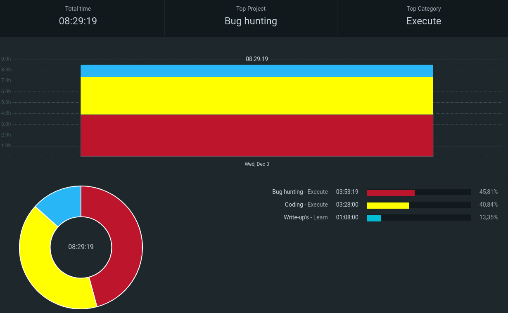

Note: I missed logging Monday and Tuesday but will definetly log it & also I'll tell lessons from Twitter 365 days challenge

## Q1 Week 12 Day 5: Perfect Day (Today — Wednesday)

### Goal for Today
- Do 6 hours Bug Hunting

### What I Did
1. Bug hunting - Api testing,learn deep about application
2. Bulid this website
3. Read 8 writeups (Checkout - https://github.com/heyiamuday/Writeups-Tracker  provides filtering, pagination, read/unread tracking, comments, bounty sorting, and a modern GitHub-style heatmap of activity on pentestland writeups )

### Key Findings
- Better to use our brain than use ai while vibe-coding

### Challenges Encountered
- To be honest, 4hrs of bug hunting is dumb&meaningless, will figure out, How to spend time wisely while hunting? 

### What I Learned
- Application is working but not securely,We should know 
how the application is supposed to work but securely & hunt based on logic flaws not Technical flaws

### Tomorrow's Focus
- Weekly goal is Complete 50 writeups, Tommorow i should cross 25
- Complete the Chapter 7 on Exploratory Software Testing book
- 6hrs Bug Hunting

---

**Stats for Today**
- ⏱️ Time Spent: 8.5 hours
- 🎯 Findings (confirmations): none
- 📚 Resources Read: 8 articles on Broken Access Control
- 🧠 Key Takeaway: We should know how the application is supposed to work but securely

---
